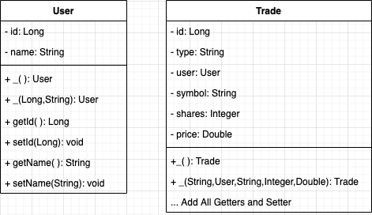

# Trade Challenge

Today you are challenged with creating a Trade API, that allows RESTful request for making Stock Trade request.

The two domain objects you must create are as follows:




Each trade is a JSON entry with the following keys:

_id_: This is the trade unique ID.

_type_: This is the trade type, buy or sell.

_user_: The user responsible for the trade. The user itself is a JSON entry consisting of following fields:

_id_: This is the user unique ID.

_name_: This is the user name.

_symbol_: This is the stock symbol.

_price_: This is the stock price for one stock (upto two places of decimal) at the time of the trade. The stock price is between 130.42 and 195.65inclusive.

_timestamp_: This is the timestamp for the trade creation given in the format yyyy-MM-dd HH:mm:ss. The timezone is EST (UTC -4).

Here is an example of how trade request would look:

```
$curl -X POST http://localhost:8080/trades/  -H "content-type: application/json"
-d "
    {
        "type": "buy",
        "user": {
            "id": 2,
            "name": "Da baron"
        },
        "symbol": "AA",
        "shares": 11,
        "price": 174.82,
        "timestamp": "2018-12-28 13:18:48"
    }"
```

* Trade types should be either buy/sell (You need to validate that the type is correct)
* Time stamp should be stored as a string

The Restful Endpoint will be `http://localhost:8080/trades`

A user should be able to:

* Get All trades
* Get All Trades by User Name
* Create a trade
* Update a trade
* Delete a trade

Most provide all UNIT TEST!!!!